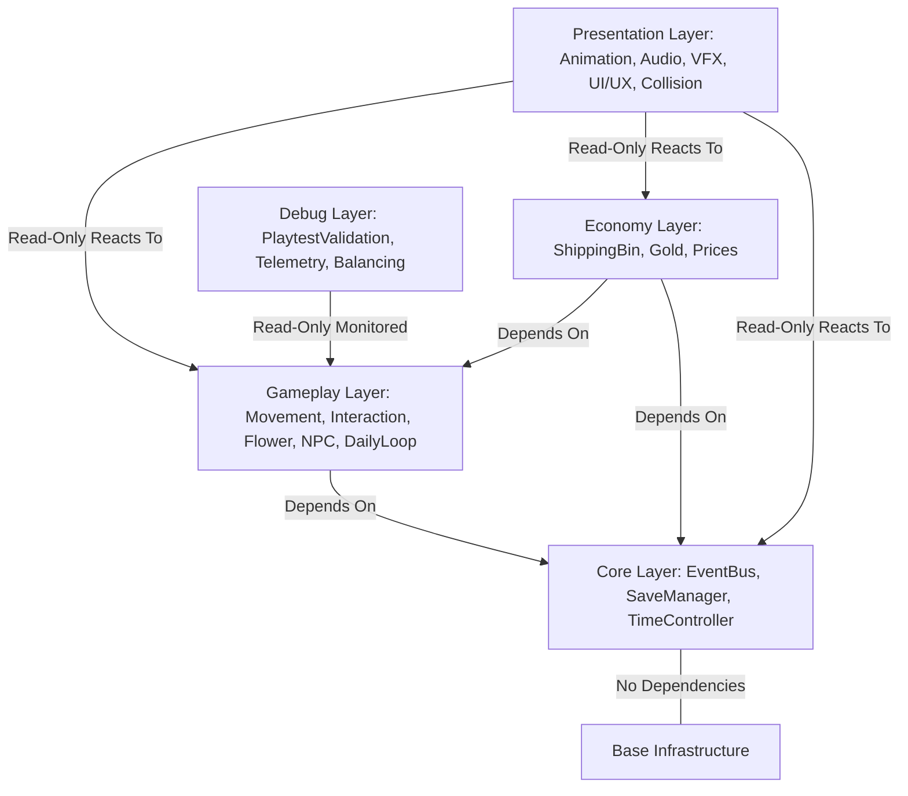

# ADR-005: Strict Unidirectional Dependency Flow & Module Boundaries

**Status:** Accepted (Sprint M4.0 — Architecture Freeze)  
**Date:** 2026-07-17  
**Authors:** Antigravity Engineering Team & Lead Game Director  

---

## 1. Context & Architectural Challenge

As **Plant Tales** completed its Milestone 3 (`M3`) Vertical Slice and achieved **PC1 (`Public Prototype Candidate 1`)** validation, the codebase accumulated over 14 distinct specialized systems. Without strict architectural boundaries, expanding content across M4 and beyond (`12+ flowers, 4 NPCs, 15 quests, village expansions`) risks introducing circular dependencies, spaghetti event chains ("God Bus"), and regression bugs where presentation logic inadvertently corrupts core simulation state.

To guarantee maintainability, high readability, and strict predictability across our GDevelop 5 Event-Driven architecture, we formally mandate **Strict Unidirectional Dependency Flow**.

---

## 2. Decision: Unidirectional Module Boundaries

All systems, objects, and scripts inside **Plant Tales** MUST adhere to a strict layered hierarchy. Data and dependencies flow downwards; notifications (via Event Bus) flow upwards.

---

## 3. Allowed vs. Forbidden Dependencies Table

| Module Layer | May Depend On (`Allowed Dependencies`) | Forbidden Dependencies (`Strictly Prohibited`) | State Mutability Rights |
| :--- | :--- | :--- | :--- |
| **Core Layer** | None (`Self-contained infrastructure`) | `Gameplay`, `Economy`, `Presentation`, `Debug` | Read & Write (`Global Queues, Time, Save Disk`) |
| **Gameplay Layer** | `Core` (`EventBusQueue`, `WorldState`, `TimeTicker`) | `Economy`, `Presentation`, `Debug` | Read & Write (`Player coordinates, Flower growth, Inventory slots`) |
| **Economy Layer** | `Gameplay`, `Core` | `Presentation`, `Debug` | Read & Write (`Gold balance, Shipping prices, Transaction logs`) |
| **Presentation Layer** | `Gameplay`, `Economy`, `Core` (`Signals & Read-Only State`) | `Debug` | **100% READ-ONLY (`NEVER mutate Gameplay or Economy variables`)** |
| **Debug Layer** | `Gameplay`, `Economy`, `Core`, `Presentation` | None (`Passive observer`) | Read-Only & Metrics Recording (`No game state modification`) |

---

## 4. Architectural Rules & Governance

### Rule 1: Presentation Cannot Mutate Gameplay State
Systems located in `Source/Systems/Presentation/` (`animation_transition_system.json`, `audio_sound_feel_system.json`, `vfx_juice_system.json`, `ui_ux_polish_system.json`, `collision_sorting_system.json`) MUST NOT modify `PlayerObject.X/Y`, `FlowerInstanceObject.growth_timer`, `g_WorldState.player_gold`, or any `InventorySlot` state.
* *Why:* Presentation systems only handle visual polish, juice, sound playback, and depth sorting. If disabled or removed, the core simulation MUST still run 100% correctly with zero data loss.

### Rule 2: Decoupled Upward Communication via Event Catalog
When a lower layer (`Gameplay` or `Economy`) needs to trigger effects in an upper layer (`Presentation`), it MUST NOT call presentation objects directly. Instead, it pushes a structured event signal into `g_EventBusQueue`.
* *Example:* `FlowerSystem` emits `GAME_FlowerHarvested`. It does not know or care if `VFXJuiceSystem` plays sparkles or `AudioSoundFeelSystem` rings a chime.

### Rule 3: State Ownership Integrity
Every variable or table in the game has a single, authoritative **Owner System**. Only the authoritative owner is permitted to modify (`ModVarGlobal / ModVarInstance`) that data structure:
* `g_WorldState.current_day / current_hour / current_minute` -> Owned by `DailyLoopSystem`.
* `g_WorldState.player_gold` -> Owned by `ShippingBinSystem / EconomySystem`.
* `FlowerInstanceObject.growth_stage / growth_timer` -> Owned by `FlowerSystem`.
* `g_EventBusQueue` -> Managed exclusively by `EventBusSystem`.

---

## 5. Review & Pull Request Checklist

Before submitting any code change or adding any new system, engineers and AI assistants MUST verify:
- [ ] Does the system reside in the correct folder (`Core`, `Gameplay`, `Economy`, `Presentation`, or `Debug`)?
- [ ] Does any Presentation or UI system attempt to modify gameplay/economy variables? (`If yes -> REJECT immediately`).
- [ ] Are all inter-module signals routed cleanly through `g_EventBusQueue` matching `Event_Catalog.md`?
- [ ] Does the change maintain 100% backwards compatibility with all `ReferenceSaves` (`TestFixtures`) without save corruption?
