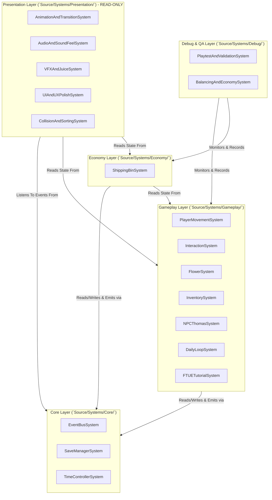

# Plant Tales — Visual Module Map & System Hierarchy

**Status:** Accepted (Sprint M4.0 — Architecture Freeze)  
**Last Modified:** 2026-07-17  
**Purpose:** Single-page architectural diagram and module map. New developers and AI assistants should read this document to understand folder layout and communication pathways within 2 minutes.

---

## 1. High-Level Dependency Flow Diagram

---

## 2. Directory Layout & Module Responsibilities

### Core (`Source/Systems/Core/`)
- **`event_bus_system.json`:** Manages `g_EventBusQueue` lifecycle, routing, and queue pruning.
- **`save_manager_system.json`:** Checks `is_dirty` flag and serializes/deserializes atomic JSON snapshots to disk.
- **`time_controller_system.json`:** Advances `g_TimeTicker` delta time and manages simulation speed (`120 / 600`).

### Gameplay (`Source/Systems/Gameplay/`)
- **`player_movement_system.json`:** Processes WASD / arrow inputs, moves `PlayerObject`, and sets `facing_direction`.
- **`interaction_system.json`:** Performs grid casting (`16px`) from player facing direction to detect soil, NPCs, bed, and shipping bin.
- **`flower_system.json`:** Manages `FlowerInstanceObject` states (`Sprout -> Growing -> Bloom`), watering checks, and harvest yields.
- **`inventory_system.json`:** Manages active satchel slots (`Slot 0: Seeds`, `Slot 1: Watering Can`) and item quantities.
- **`npc_thomas_system.json`:** Handles NPC dialogue state machine, greeting, and seed gifting.
- **`daily_loop_system.json`:** Manages day/night transition, bed interaction, and `DailySummaryBoxObject` rendering.
- **`ftue_tutorial_system.json`:** Tracks first-time user guidance states (`STATE_0_GREETING -> STATE_4_COMPLETED`).

### Economy (`Source/Systems/Economy/`)
- **`shipping_bin_system.json`:** Manages items placed inside `ShippingBinObject`, calculates unit prices (`50G for White Lily`), and credits `player_gold`.

### Presentation (`Source/Systems/Presentation/`) — *Strictly Read-Only!*
- **`animation_transition_system.json`:** Syncs walk speed scales, smooth 4-way turn-arounds, and bed sleep pause (`0.5s`).
- **`audio_sound_feel_system.json`:** Plays footstep cadence (`0.35s`), farming action SFX, coin clink, and morning BGM.
- **`vfx_juice_system.json`:** Spawns dust puffs, water splashes, bloom sparkles, gold coin pop text, and screen shake (`0.15s`).
- **`ui_ux_polish_system.json`:** Formats HUD AM/PM time, dialogue padding, continue arrow prompts, and satchel outlines/tooltips.
- **`collision_sorting_system.json`:** Clamps camera bounds, updates dynamic 2.5D Y-sorting (`zOrder = Y()`), and separates hitboxes.

### Debug (`Source/Systems/Debug/`)
- **`playtest_validation_system.json`:** Audits FTUE pacing (`4-6 minutes`), verifies atomic save integrity, and checks `<1,000 objects` / `60 FPS`.
- **`balancing_economy_system.json`:** Applies clock speed parameters (`120/600`), growth targets (`1080m`), and stamina locks (`100`).
